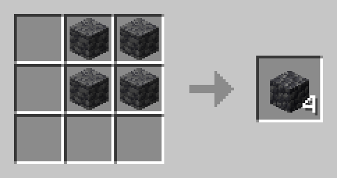
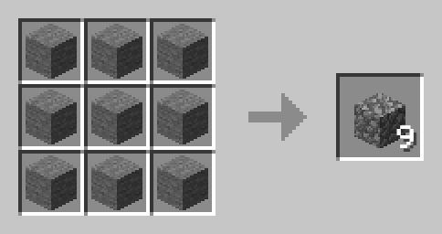

# Crafting recipes

## Crafting table

### Craftables

#### Amethyst buds and clusters

> :twisted_rightwards_arrows: Shapeless recipe

#### Saddle

<!-- TODO: Create image -->

#### Hoppers using barrels

<!-- TODO: Create image -->

#### Smooth Stone

<!-- TODO: Create image -->

### Unpackables

#### Amethyst block to amethyst shards

#### Glowstone block to glowstone dust

### Converters

#### Deepslate to cobbled deepslate

<!-- TODO: Create image -->

#### Stone to cobblestone

<!-- TODO: Create image -->

### More Blocks

#### More nether bricks

<!-- TODO: Create image -->

#### More red nether bricks

<!-- TODO: Create image -->

