# Crafting recipes

## Crafting table

### Craftables

#### Amethyst buds and clusters

> :twisted_rightwards_arrows: Shapeless recipe

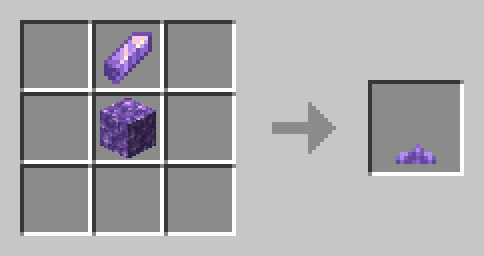

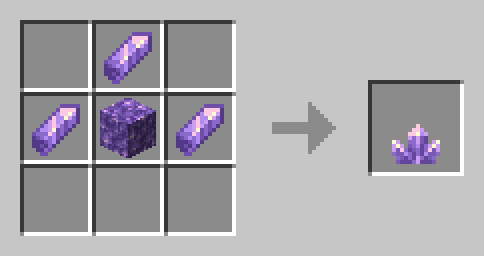

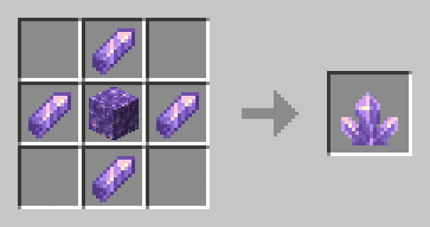

#### Deepslate to cobbled deepslate

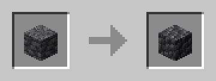

#### Hoppers using barrels

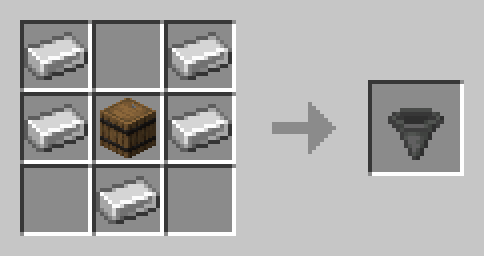

#### Hoppers using trapped chests

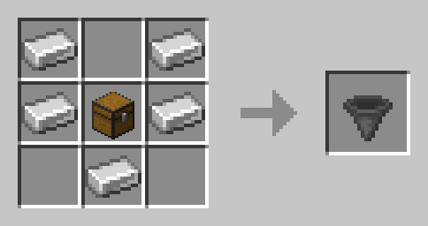

#### Saddle

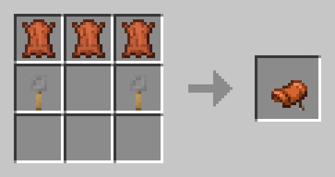

#### Smooth Stone

#### Stone to cobblestone

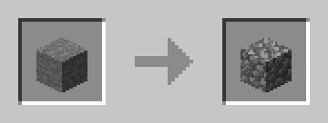

### Unpackables

#### Amethyst block to amethyst shards

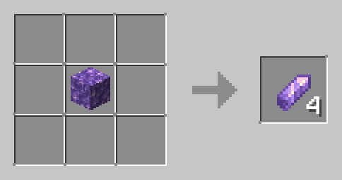

#### Glowstone block to glowstone dust

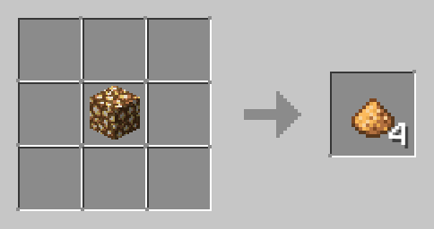

### More Blocks

#### More nether bricks

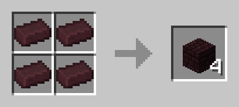

#### More red nether bricks

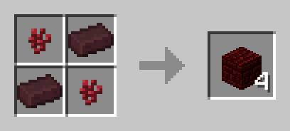

 <!-- TODO: Make consistent 2x2 and 3x3 recipes -->
 <!-- TODO: Adjust categories -->
